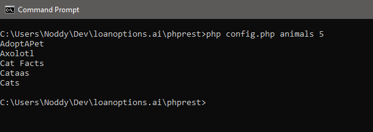
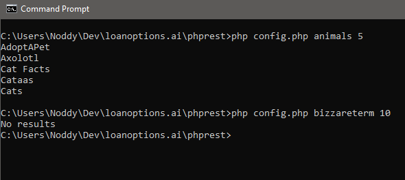
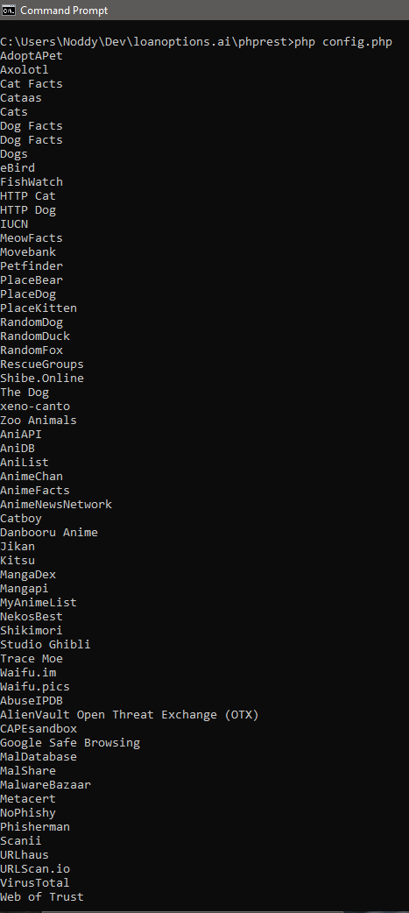
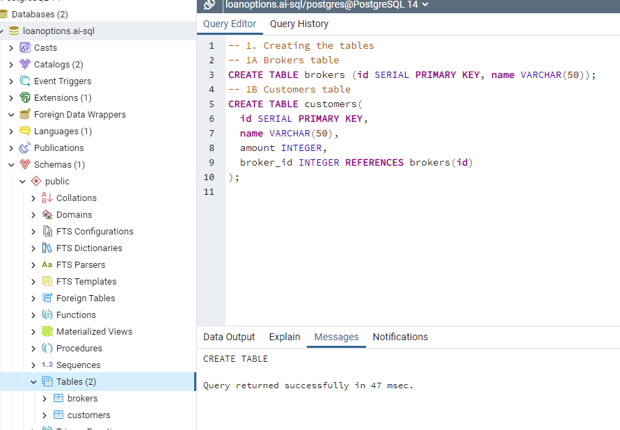
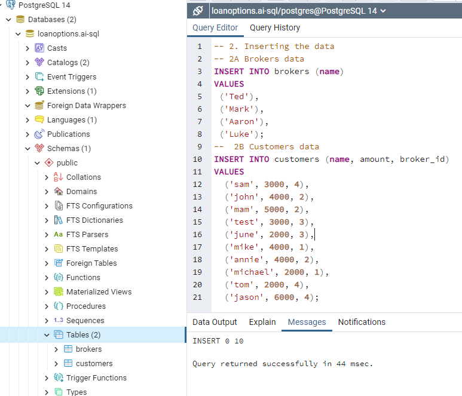
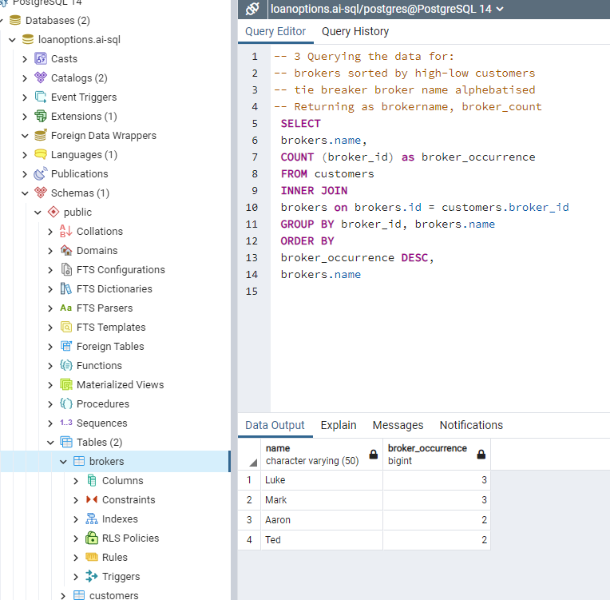

# LoanOptions.ai
### Assessment Task Parts 2 & 3
##### By Nathan O'Donnell

### Task 2 - API | PHP
<b>Task:</b> Create a PHP file which when executed from the command line, prints the values based on the arguments passed

##### When Passed Valid Arguments

##### When Passed Invalid Arguments

##### When Passed No Arguments

<b>Note:</b> The results are not sorted alphabetically as requested as I was unable to work out how to do so in PHP.

### Task 3 - SQL
<b>Task</b> Write an SQL query to generate a summary of how many customers are under a particular broker, sorted by highest-lowest number of customers and then alphabetically.

##### A. Generating the tables

##### B. Passing the initial data

##### C. Fetching the results

